# Bellini Classes
# Use Case Documentation
# UseCases_Pj2_T-XX

---

## Use Case Index

| ID | Use Case Name | Primary Actor | Related User Story |
|---|---|---|---|
| UC-01 | Manage Course Sections | Admin / TA Coordinator | User Story 3 |
| UC-02 | Assign TA to Section | TA Coordinator | User Story 1 |
| UC-03 | Compare Enrollment Trends | Department Advisor / Admin | User Story 2 |
| UC-04 | Generate and Export Workload Report | Department Chair / Admin | User Story 7 |

---

## UC-01: Manage Course Sections | Version 1.0

**Use Case Description**
An Admin, Department Chair, TA Coordinator, or Facilities user logs into the Bellini Classes system and navigates to the Sections page to view, create, edit, or delete course section records. The system provides a filtered list of sections across semesters and validates all inputs before persisting changes. Every create, edit, or delete action is written to the audit log, ensuring a complete change history.

**Stereotype and Package**
Not applicable.

**Actors**
- Primary Actor: Admin — initiates the use case with full CRUD authority over all sections.
- Secondary Actors: Department Chair, TA Coordinator, Facilities — access the same page with read or limited write permissions per their role.
- Secondary Actor: Bellini Classes Database — stores section records and the audit_log.

**Preconditions**
- PC1: The user is logged in with a role that permits section management (Admin, Chair, TACoord, or Facilities).
- PC2: The sections table and audit_log table exist and are accessible.
- PC3: At least one semester record exists for the semester filter dropdown.

**Postconditions**
- PO1: Any added section is persisted in the sections table and visible in the filtered list.
- PO2: Any edited section reflects the updated field values in the database.
- PO3: Any deleted section is removed from the database.
- PO4: A CREATE, UPDATE, or DELETE entry is written to audit_log for every successful change.
- PO5: A success notification is displayed to the user after each operation.

**Use Case Relationships**
None. This use case does not include, extend, or inherit any other use cases.

**Basic Flow**
1. User navigates to the Sections page.
2. System displays the section list with semester filter and optional column filters.
3. User selects a semester and applies optional filters.
4. System refreshes the filtered section list.
5. User chooses an action: Add Section, Edit Section, or Delete Section. (A1, A2, A3)
6. Add path: System opens a blank Add Section form. User enters CRN, course, instructor, room, meeting days, and meeting times, then submits. System validates inputs. (E1)
7. If valid, system saves the section record, writes a CREATE entry to audit_log, and displays a success notification.
8. Edit path: System opens a pre-filled Edit Section form with existing values. User modifies desired fields and submits. Same validation and save flow as Add.
9. Delete path: System shows a delete confirmation dialog. If the user confirms, system deletes the section record, writes a DELETE entry to audit_log, and displays a success notification.
10. User returns to the filtered section list.

**Alternative Flows**
- A1 — Validation Errors (Add/Edit): At step 6/8, if any required field is missing or malformed, the system highlights the offending fields and returns the user to the form. No database write occurs.
- A2 — User Cancels Delete: At step 9, if the user clicks Cancel on the confirmation dialog, the system returns to the filtered section list without any change.
- A3 — No Sections Match Filter: At step 4, if no sections match the selected semester or applied filters, the system displays an empty list with a "No sections found for the selected criteria." message.

**Exceptions**
- E1 — Database Write Failure: At step 7 or 8, if the database operation fails, the system displays: "Unable to save changes. Please try again." The audit_log entry is not written and the existing data is unchanged.

**Constraints**
- C1: All changes must be recorded in audit_log with the acting user's identity, timestamp, and before/after values.
- C2: CRN must be unique within a semester.
- C3: Room and meeting time must be validated against existing sections to surface conflicts.

**UI Specifications**
UI-01: Sections Page — filterable table of sections with semester dropdown. Inline Add, Edit, and Delete controls. Validation error highlights on the form. Success notification toast on completion.

**Metrics (Complexity)**
Medium. Multiple actors with different permission levels; three distinct CRUD sub-flows; audit logging on every write.

**Priority**
High — foundational data management feature required by all downstream features.

**Status**
Initial

**Author & History**
Author: Dana. Version 1.0 — initial draft.

**Reference Material**
User Story 3. Bellini Classes project requirements document.

---

## UC-02: Assign TA to Section | Version 1.0

**Use Case Description**
The TA Coordinator navigates to the TA Management page, locates a course section, and assigns a TA with a weekly hours allocation. The system checks for duplicate assignments and compares the resulting TA-hours-to-enrolled-student ratio against a configured threshold before saving. If the threshold is exceeded, the coordinator is warned but may override. On save, the system queues an email notification to the TA via the notifications table and refreshes the ratio table.

**Stereotype and Package**
Not applicable.

**Actors**
- Primary Actor: TA Coordinator — initiates the use case by selecting a section and submitting a TA assignment.
- Secondary Actor: Admin — may also perform TA assignments with the same interface.
- Secondary Actor: Bellini Classes Database — stores ta_assignments, sections, and notifications records; exposes the section_ta_ratios view.
- Secondary Actor: Email Notification Service (Resend via Edge Function) — delivers assignment notification emails to the TA.

**Preconditions**
- PC1: The TA Coordinator is logged in with coordinator-level access.
- PC2: At least one course section and at least one TA record exist in the database.
- PC3: Enrollment data for the target section is present so the ratio can be calculated.
- PC4: A minimum TA-hours-to-student ratio threshold is configured in system settings.

**Postconditions**
- PO1: The new ta_assignments record is saved with the selected TA, section, and weekly hours.
- PO2: The section_ta_ratios view reflects the updated ratio for the affected section.
- PO3: A notifications record is queued for the assigned TA; the Edge Function delivers the email within 24 hours.
- PO4: The TA ratio table on screen is refreshed to show the updated assignment and flag status.

**Use Case Relationships**
None. This use case does not include, extend, or inherit any other use cases.

**Basic Flow**
1. TA Coordinator navigates to the TA Management page.
2. System displays all sections with their current TA assignments and ratio indicators.
3. Coordinator locates the target section using semester or course filters.
4. Coordinator clicks "Assign TA" on the selected section.
5. System displays the TA assignment form with a list of available TAs.
6. Coordinator selects a TA and enters the weekly hours allocation.
7. Coordinator submits the assignment.
8. System checks whether this TA is already assigned to the same section. (E1)
9. System calculates the projected TA-hours-to-enrolled-student ratio. (A1)
10. If within threshold, system saves the ta_assignments record.
11. System queues an email notification for the TA in the notifications table.
12. System refreshes the TA ratio table with updated data.

**Alternative Flows**
- A1 — Ratio Exceeds Threshold: At step 9, if the calculated ratio would exceed the configured threshold, the system displays an over-threshold warning. The coordinator may confirm to proceed anyway or return to step 6 to adjust hours.
- A2 — Coordinator Overrides Warning: The coordinator confirms despite the warning. The system proceeds with save, notification, and refresh as in steps 10–12, with the section marked as over-threshold in the ratio table.

**Exceptions**
- E1 — Duplicate Assignment: At step 8, if the selected TA is already assigned to the same section, the system displays a duplicate assignment error and returns the coordinator to step 6.
- E2 — Email Service Unavailable: At step 11, if the notifications queue write fails, the assignment is still saved and the system logs the failure for retry by the Edge Function.

**Constraints**
- C1: A TA may not be assigned to the same section more than once.
- C2: Ratio must be recalculated automatically whenever enrollment or TA hours are updated.
- C3: Email notifications must be delivered within 24 hours of assignment creation.
- C4: Sections with zero enrolled students are excluded from ratio calculations to prevent division errors.

**UI Specifications**
UI-02: TA Management Page — section table with ratio indicators and per-section "Assign TA" controls. TA assignment form with TA selector and hours input. Over-threshold warning modal. Ratio table auto-refreshes after save.

**Metrics (Complexity)**
Medium-High. Single primary actor; involves duplicate detection, ratio threshold logic, database write, and external email notification via Edge Function.

**Priority**
High — core TA resource allocation feature; ratio flagging enables proactive identification of under-supported courses.

**Status**
Initial

**Author & History**
Author: Alex. Version 1.0 — initial draft.

**Reference Material**
User Story 1. Bellini Classes project requirements document.

---

## UC-03: Compare Enrollment Trends | Version 1.0

**Use Case Description**
A Department Advisor or Admin navigates to the Enrollment Comparison page to view a side-by-side enrollment table derived from the enrollment_comparison database view. The table shows each course with its Spring 2025 enrollment, Fall 2025 enrollment, and the percentage change between semesters. The user may filter by subject or campus and sort by any column to identify courses with notable enrollment shifts.

**Stereotype and Package**
Not applicable.

**Actors**
- Primary Actor: Department Advisor — initiates the use case to analyze enrollment patterns across semesters.
- Secondary Actor: Admin — may also access the enrollment comparison page.
- Secondary Actor: Bellini Classes Database — provides the enrollment_comparison view with per-course semester enrollment and percentage change data.

**Preconditions**
- PC1: The user is logged in with Advisor or Admin access.
- PC2: The enrollment_comparison view is populated with data for Spring 2025 and Fall 2025.
- PC3: At least one course section exists in both semesters.

**Postconditions**
- PO1: The enrollment comparison table is displayed with Course, Spring 2025 enrollment, Fall 2025 enrollment, and Percent Change columns.
- PO2: If filters are applied, the table reflects only the filtered subset of courses.
- PO3: If a column header is clicked, the table is sorted by that column.

**Use Case Relationships**
None. This use case does not include, extend, or inherit any other use cases.

**Basic Flow**
1. User navigates to the Enrollment Comparison page.
2. System queries the enrollment_comparison view for Spring 2025 and Fall 2025 data.
3. System displays a table with columns: Course, S25 Enrollment, F25 Enrollment, and Percent Change.
4. Highlighted rows indicate courses with significant enrollment changes. (A1)
5. User optionally selects a subject or campus filter. (A2)
6. User optionally clicks a column header to sort the table. (A3)
7. User reviews enrollment trends and draws conclusions.
8. User navigates away or resets filters.

**Alternative Flows**
- A1 — No Significant Changes: At step 4, if no courses exceed the change threshold, no rows are highlighted and all rows display in the default style.
- A2 — Filter Applied: At step 5, the user selects a subject or campus. The system refreshes the table showing only courses matching the selected filter. The user may clear the filter to restore the full list.
- A3 — Column Sort: At step 6, the user clicks a column header. The system re-orders rows by the selected column in ascending order; a second click sorts descending.

**Exceptions**
- E1 — View Query Failure: At step 2, if the enrollment_comparison view cannot be queried, the system displays: "Unable to load enrollment data. Please try again later." The user is returned to the dashboard.

**Constraints**
- C1: The comparison must always show both Spring 2025 and Fall 2025 by default.
- C2: Percent change must be computed as: ((F25 − S25) / S25) × 100, rounded to one decimal place.
- C3: Courses that appear in only one semester must still be included with zero for the missing semester.

**UI Specifications**
UI-03: Enrollment Comparison Page — tabular view with Course, S25, F25, and Percent Change columns. Subject and campus filter controls above the table. Clickable column headers for sorting. Row highlighting for significant changes.

**Metrics (Complexity)**
Low-Medium. Single primary actor; read-only view of a pre-computed database view; filtering and sorting handled client-side.

**Priority**
High — enables data-driven course planning and resource allocation decisions across semesters.

**Status**
Initial

**Author & History**
Author: Bri. Version 1.0 — initial draft.

**Reference Material**
User Story 2. Bellini Classes project requirements document.

---

## UC-04: Generate and Export Workload Report | Version 1.0

**Use Case Description**
A Department Chair or Admin navigates to the Workload page, where the system automatically aggregates per-instructor data from the instructor_workload database view. The report displays each instructor's total sections taught, total enrolled students, and total TA hours supervised for the selected semester. The Chair may filter by semester and export the completed report as a PDF (via jsPDF) or Excel file (via ExcelJS), which is streamed directly to their device for use in faculty performance reviews.

**Stereotype and Package**
Not applicable.

**Actors**
- Primary Actor: Department Chair — initiates the use case by navigating to the Workload page and optionally exporting the report.
- Secondary Actor: Admin — may also generate and export workload reports.
- Secondary Actor: Bellini Classes Database — provides the instructor_workload view with per-instructor aggregated data.
- Secondary Actor: Export Service (jsPDF / ExcelJS via /api/export/workload) — generates and streams the downloadable report file.

**Preconditions**
- PC1: The Department Chair is logged in with Chair or Admin access.
- PC2: The instructor_workload view contains data for at least one semester.
- PC3: The export API routes (/api/export/workload?format=pdf and ?format=excel) are operational.

**Postconditions**
- PO1: The workload summary table is displayed with columns for Instructor, Section Count, Total Enrollment, and Total TA Hours.
- PO2: If a semester filter is applied, the table reflects only data for that semester.
- PO3: If exported, a properly formatted PDF or .xlsx file is downloaded to the Chair's device.

**Use Case Relationships**
None. This use case does not include, extend, or inherit any other use cases.

**Basic Flow**
1. Department Chair navigates to the Workload page.
2. System queries the instructor_workload view and displays the workload summary table.
3. Table columns show: Instructor, Section Count, Total Enrollment, and Total TA Hours.
4. Chair selects a semester from the dropdown filter to scope the data. (A1)
5. System refreshes the workload data for the selected semester.
6. Chair reviews the on-screen report. (A2)
7. Chair clicks "Export" and selects PDF or Excel format. (A3, E1)
8. PDF path: System calls /api/export/workload?format=pdf. Server generates a PDF via jsPDF and streams it as a download.
9. Excel path: System calls /api/export/workload?format=excel. Server generates an .xlsx file via ExcelJS and streams it as a download.
10. Browser downloads the file to the Chair's device.

**Alternative Flows**
- A1 — No Semester Filter (Default): At step 4, if the Chair does not change the semester filter, the system displays the default view across all available semesters.
- A2 — Chair Does Not Export: At step 6, if the Chair only needs to review the data on screen, they skip steps 7–10 and navigate away. No file is generated.
- A3 — Export to Excel: At step 7, the Chair selects Excel. The system generates an .xlsx file with one instructor per row and columns for section count, enrollment, and TA hours.

**Exceptions**
- E1 — Export Service Unavailable: At step 8 or 9, if the export API route fails, the system displays: "Export failed. Please try again or contact support." The on-screen report remains visible for manual reference.

**Constraints**
- C1: The workload view must accurately aggregate sections, enrollment, and TA hours per instructor per semester.
- C2: Instructors with no assigned sections in the selected semester must still appear with zero values.
- C3: Exported files must be openable in standard PDF viewers and Microsoft Excel without formatting errors.
- C4: The export API must stream the file response rather than holding it in memory for large datasets.

**UI Specifications**
UI-04: Workload Page — instructor workload table with Instructor, Section Count, Total Enrollment, and Total TA Hours columns. Semester dropdown filter. Export button with PDF/Excel format selector.

**Metrics (Complexity)**
Medium. Single primary actor; involves a pre-aggregated database view, semester filtering, and two export code paths (PDF via jsPDF, Excel via ExcelJS) served from dedicated API routes.

**Priority**
High — directly supports faculty performance reviews and equitable teaching load decisions.

**Status**
Initial

**Author & History**
Author: Bri. Version 1.0 — initial draft.

**Reference Material**
User Story 7. Bellini Classes project requirements document.

---

## UML Diagrams

---

### Interaction Overview Diagrams

An Interaction Overview Diagram (IOD) specifies which use cases are needed to satisfy a given user story and the typical order in which the user performs them. All use cases referenced below — including those not separately documented in detail — also appear in the team's Use Case Diagram. A use case common to multiple user stories (e.g., UC-Login) appears in multiple IODs.

---

#### IOD(1)_Pj2_T-XX — User Story 1: Assign TA to Section

**Primary Actor:** TA Coordinator
**Goal:** Assign a TA to a course section with ratio-threshold monitoring and automatic email notification to the TA.

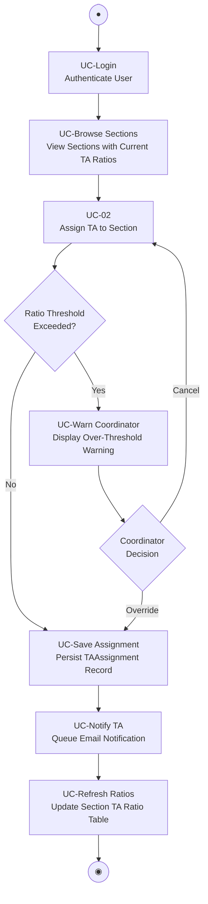

---

#### IOD(2)_Pj2_T-XX — User Story 2: Compare Enrollment Trends

**Primary Actor:** Department Advisor
**Goal:** View and analyze semester-to-semester enrollment changes using filtering and column sorting.

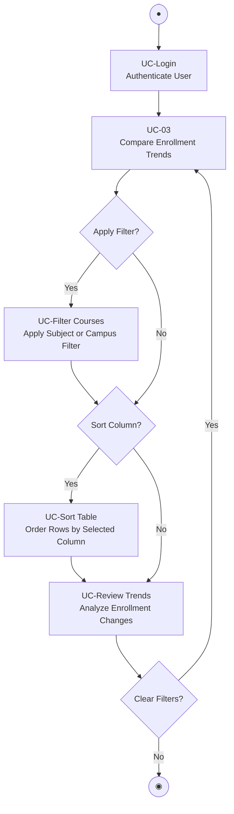

---

#### IOD(3)_Pj2_T-XX — User Story 3: Manage Course Sections

**Primary Actor:** Admin
**Goal:** Create, edit, and delete course section records; log every change to the audit trail.

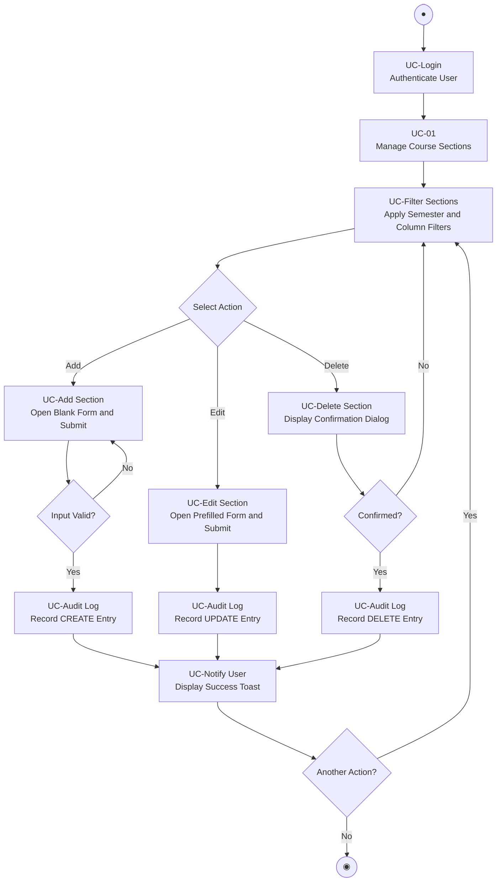

---

#### IOD(4)_Pj2_T-XX — User Story 7: Generate and Export Workload Report

**Primary Actor:** Department Chair
**Goal:** View instructor workload summary, optionally filter by semester, and export to PDF or Excel.

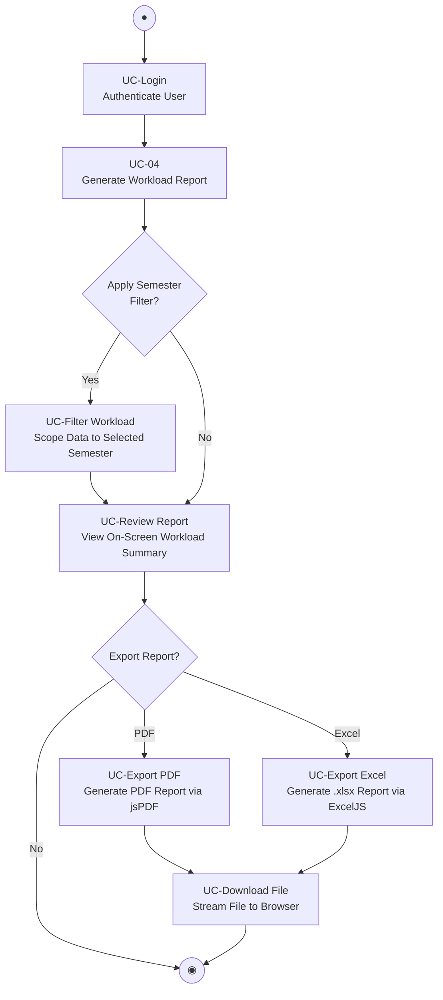

---

#### IOD(5)_Pj2_T-XX — User Story 3: Room Utilization Heatmap

**Primary Actor:** Facilities and Space Planning Coordinator
**Goal:** Generate a visual weekly room-utilization heatmap, identify underused rooms, and reassign them to sections lacking a meeting space.

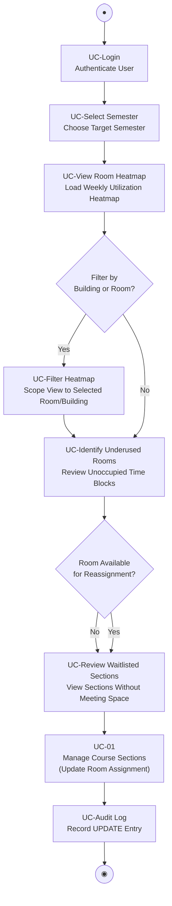

---

#### IOD(6)_Pj2_T-XX — User Story 4: Instructor Personalized Schedule View

**Primary Actor:** Individual Instructor
**Goal:** View an aggregated personal calendar of all assigned sections across all available semesters showing room, time, enrollment, and TAs.

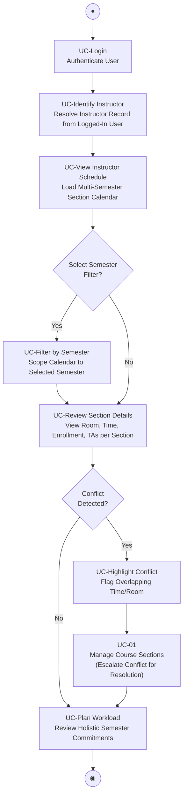

---

#### IOD(7)_Pj2_T-XX — User Story 5: Course Availability Search and Timeline

**Primary Actor:** Student Academic Advisor
**Goal:** Search any course by subject and number and view a multi-semester availability timeline including meeting times, enrollment trends, and instructor history.

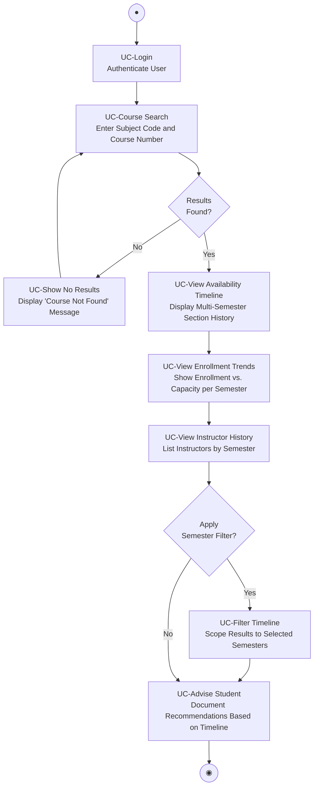

---

#### IOD(8)_Pj2_T-XX — User Story 6: TA Self-Service Portal

**Primary Actor:** TA / UGTA
**Goal:** Access a self-service portal to view assigned courses, allocated hours, and receive email notifications for assignment changes.

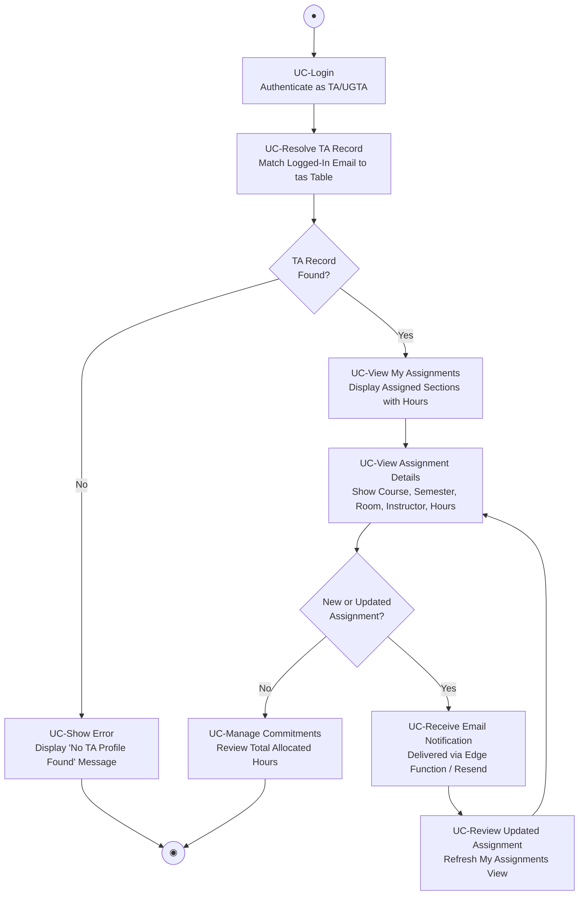

---

#### IOD(9)_Pj2_T-XX — User Story 8: Waitlist Imbalance Alerts

**Primary Actor:** Class Scheduling Committee Member
**Goal:** Receive automatic alerts when a section's waitlist exceeds 20% of max enrollment across two consecutive semesters and escalate expansion requests to department leadership.

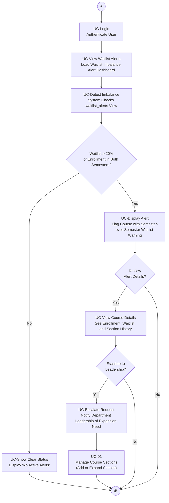

---

### Classes_MOPS_Pj2_T-03 — Entity Class Diagram (Analysis Level)

**Description:** Analysis-level (MOPS) class diagram specifying the entity/model classes needed to support UC-01 through UC-04. Attributes are listed by name without access modifiers or explicit types; methods are listed by name without formal signatures. `EnrollmentComparison` and `InstructorWorkload` represent derived database views computed from the base entity tables. Relationships include associations and derivation dependencies with multiplicities.

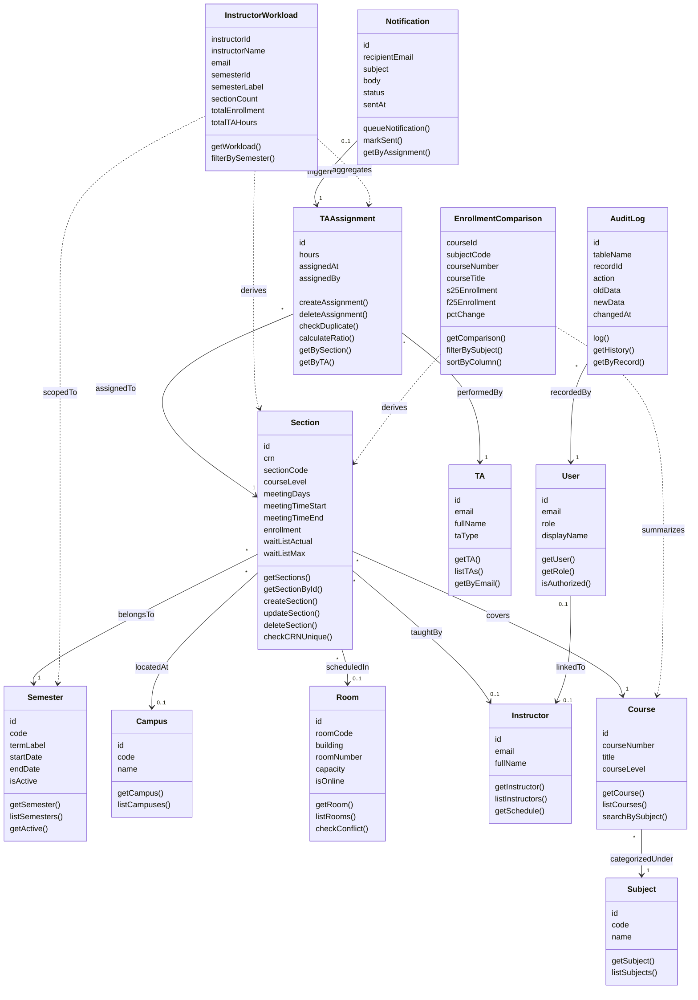

---

### Classes_MOSS_Pj2_T-03 — Design Class Diagram (MOSS Level)

**Description:** Design-level (MOSS) class diagram specifying the boundary, control, and entity classes required to implement UC-01 through UC-04. All data members include access modifiers (`+` public, `-` private) and explicit types; all operations include typed parameters and return types. Method signatures are informed by and verified against the four Sequence Diagrams below.

```mermaid
classDiagram
    %% ── Boundary Classes ─────────────────────────────────────────────────────

    class SectionsPage {
        -sections : SectionWithRelations[]
        -selectedSemesterId : number
        -isLoading : boolean
        +fetchSections(semesterId : number) Promise~void~
        +openAddForm() void
        +openEditForm(id : number) void
        +confirmDelete(id : number) void
        +showSuccessToast(message : string) void
        +refreshSectionList() void
    }

    class TAManagementPage {
        -sectionRatios : SectionTARatio[]
        -selectedSectionId : number
        -isLoading : boolean
        +fetchSectionRatios(semesterId : number) Promise~void~
        +openAssignForm(sectionId : number) void
        +showRatioWarning(ratio : number) void
        +refreshRatioTable() void
    }

    class EnrollmentComparisonPage {
        -enrollmentData : EnrollmentRow[]
        -subjectFilter : string
        -sortColumn : string
        -sortDirection : string
        +fetchEnrollmentData() Promise~void~
        +applySubjectFilter(subject : string) void
        +applyCampusFilter(campus : string) void
        +sortTable(column : string, direction : string) void
        +resetFilters() void
    }

    class WorkloadPage {
        -workloadData : WorkloadRow[]
        -semesterFilter : number
        -isLoading : boolean
        +fetchWorkloadData(semesterId : number) Promise~void~
        +applyFilter(semesterId : number) void
        +exportPDF() Promise~void~
        +exportExcel() Promise~void~
    }

    %% ── Control Classes ──────────────────────────────────────────────────────

    class SectionController {
        -supabase : SupabaseClient
        +GET(request : Request) Promise~NextResponse~
        +POST(request : Request) Promise~NextResponse~
        -validateAuth(supabase : SupabaseClient) Promise~User~
        -checkRole(role : string, allowed : string[]) boolean
    }

    class TAAssignmentController {
        -supabase : SupabaseClient
        +GET(request : Request) Promise~NextResponse~
        +POST(request : Request) Promise~NextResponse~
        -validateAuth(supabase : SupabaseClient) Promise~User~
        -checkDuplicate(sectionId : number, taId : number) Promise~boolean~
        -calculateRatio(sectionId : number, newHours : number) Promise~number~
        -queueNotification(taEmail : string, assignmentId : number) Promise~void~
    }

    class EnrollmentController {
        -supabase : SupabaseClient
        +GET(request : Request) Promise~NextResponse~
    }

    class WorkloadController {
        -supabase : SupabaseClient
        +GET(request : Request) Promise~NextResponse~
    }

    class ExportController {
        -supabase : SupabaseClient
        +GET(request : Request) Promise~NextResponse~
        -generatePDF(data : WorkloadRow[]) Promise~Buffer~
        -generateExcel(data : WorkloadRow[]) Promise~Buffer~
        -streamResponse(buffer : Buffer, filename : string, mime : string) NextResponse
    }

    %% ── Entity Classes ───────────────────────────────────────────────────────

    class Semester {
        +id : number
        +code : string
        +termLabel : string
        +startDate : string
        +endDate : string
        +isActive : boolean
        +getSemester(supabase : SupabaseClient, id : number) Promise~Semester~
        +listSemesters(supabase : SupabaseClient) Promise~Semester[]~
        +getActive(supabase : SupabaseClient) Promise~Semester~
    }

    class Subject {
        +id : number
        +code : string
        +name : string
        +getSubject(supabase : SupabaseClient, id : number) Promise~Subject~
        +listSubjects(supabase : SupabaseClient) Promise~Subject[]~
    }

    class Campus {
        +id : number
        +code : string
        +name : string
        +getCampus(supabase : SupabaseClient, id : number) Promise~Campus~
        +listCampuses(supabase : SupabaseClient) Promise~Campus[]~
    }

    class Room {
        +id : number
        +roomCode : string
        +building : string
        +roomNumber : string
        +capacity : number
        +isOnline : boolean
        +getRoom(supabase : SupabaseClient, id : number) Promise~Room~
        +listRooms(supabase : SupabaseClient) Promise~Room[]~
        +checkConflict(supabase : SupabaseClient, roomId : number, days : string, start : string, end : string) Promise~boolean~
    }

    class Instructor {
        +id : number
        +email : string
        +fullName : string
        +getInstructor(supabase : SupabaseClient, id : number) Promise~Instructor~
        +listInstructors(supabase : SupabaseClient) Promise~Instructor[]~
        +getSchedule(supabase : SupabaseClient, id : number, semesterId : number) Promise~Section[]~
    }

    class User {
        +id : string
        +email : string
        +role : UserRole
        +displayName : string
        +getUser(supabase : SupabaseClient, id : string) Promise~User~
        +getRole(supabase : SupabaseClient) Promise~UserRole~
    }

    class Course {
        +id : number
        +subjectId : number
        +courseNumber : string
        +title : string
        +courseLevel : CourseLevel
        +getCourse(supabase : SupabaseClient, id : number) Promise~Course~
        +listCourses(supabase : SupabaseClient) Promise~Course[]~
        +searchBySubject(supabase : SupabaseClient, subjectCode : string, courseNumber : string) Promise~Course[]~
    }

    class Section {
        +id : number
        +semesterId : number
        +campusId : number
        +courseId : number
        +crn : string
        +sectionCode : string
        +meetingDays : string
        +meetingTimeStart : string
        +meetingTimeEnd : string
        +roomId : number
        +enrollment : number
        +waitListActual : number
        +waitListMax : number
        +instructorId : number
        +createdBy : string
        +getSections(supabase : SupabaseClient, filters : SectionFilters) Promise~Section[]~
        +getSectionById(supabase : SupabaseClient, id : number) Promise~Section~
        +createSection(supabase : SupabaseClient, data : SectionInsert) Promise~Section~
        +updateSection(supabase : SupabaseClient, id : number, data : SectionUpdate) Promise~Section~
        +deleteSection(supabase : SupabaseClient, id : number) Promise~void~
        +checkCRNUnique(supabase : SupabaseClient, crn : string, semesterId : number) Promise~boolean~
    }

    class TA {
        +id : number
        +email : string
        +fullName : string
        +taType : TAType
        +getTA(supabase : SupabaseClient, id : number) Promise~TA~
        +listTAs(supabase : SupabaseClient) Promise~TA[]~
        +getByEmail(supabase : SupabaseClient, email : string) Promise~TA~
    }

    class TAAssignment {
        +id : number
        +sectionId : number
        +taId : number
        +hours : number
        +assignedAt : string
        +assignedBy : string
        +createAssignment(supabase : SupabaseClient, data : TAAssignmentInsert) Promise~TAAssignment~
        +getBySection(supabase : SupabaseClient, sectionId : number) Promise~TAAssignment[]~
        +getByTA(supabase : SupabaseClient, taId : number) Promise~TAAssignment[]~
        +deleteAssignment(supabase : SupabaseClient, id : number) Promise~void~
    }

    class Notification {
        +id : number
        +recipientEmail : string
        +subject : string
        +body : string
        +status : string
        +taAssignmentId : number
        +sentAt : string
        +queueNotification(supabase : SupabaseClient, data : NotificationInsert) Promise~Notification~
        +markSent(supabase : SupabaseClient, id : number) Promise~void~
        +getByAssignment(supabase : SupabaseClient, assignmentId : number) Promise~Notification~
    }

    class AuditLog {
        +id : number
        +tableName : string
        +recordId : number
        +action : string
        +changedBy : string
        +oldData : Json
        +newData : Json
        +changedAt : string
        +log(supabase : SupabaseClient, entry : AuditLogInsert) Promise~AuditLog~
        +getHistory(supabase : SupabaseClient, tableName : string, recordId : number) Promise~AuditLog[]~
    }

    class EnrollmentComparison {
        +courseId : number
        +subjectCode : string
        +courseNumber : string
        +courseTitle : string
        +s25Enrollment : number
        +f25Enrollment : number
        +pctChange : number
        +getComparison(supabase : SupabaseClient) Promise~EnrollmentComparison[]~
    }

    class InstructorWorkload {
        +instructorId : number
        +instructorName : string
        +email : string
        +semesterId : number
        +semesterLabel : string
        +sectionCount : number
        +totalEnrollment : number
        +totalTAHours : number
        +getWorkload(supabase : SupabaseClient, semesterId : number) Promise~InstructorWorkload[]~
    }

    %% ── Boundary → Control ───────────────────────────────────────────────────
    SectionsPage ..> SectionController : calls
    TAManagementPage ..> TAAssignmentController : calls
    EnrollmentComparisonPage ..> EnrollmentController : calls
    WorkloadPage ..> WorkloadController : calls
    WorkloadPage ..> ExportController : calls

    %% ── Control → Entity ─────────────────────────────────────────────────────
    SectionController ..> Section : manages
    SectionController ..> AuditLog : writes
    TAAssignmentController ..> TAAssignment : manages
    TAAssignmentController ..> Notification : queues
    EnrollmentController ..> EnrollmentComparison : queries
    WorkloadController ..> InstructorWorkload : queries
    ExportController ..> InstructorWorkload : reads

    %% ── Entity Associations ──────────────────────────────────────────────────
    Section "*" --> "1" Semester
    Section "*" --> "1" Course
    Section "*" --> "0..1" Instructor
    Section "*" --> "0..1" Room
    Section "*" --> "0..1" Campus
    Course "*" --> "1" Subject
    TAAssignment "*" --> "1" Section
    TAAssignment "*" --> "1" TA
    Notification "0..1" --> "1" TAAssignment
    AuditLog "*" --> "1" User
    InstructorWorkload ..> Section : derives
    InstructorWorkload ..> TAAssignment : aggregates
    InstructorWorkload ..> Semester
    EnrollmentComparison ..> Section : derives
    EnrollmentComparison ..> Course : summarizes
```

---

### Sequence Diagrams

Each sequence diagram documents one of the four fully detailed use cases at design level. Every diagram includes at least one boundary object (page/UI component), one or more control objects (Next.js API route handlers), and one or more entity/model objects (data layer). Message names correspond to the operations defined in `Classes_MOSS_Pj2_T-03` and are used to verify and refine those method signatures.

---

#### Sequence(1)_MOSS_Pj2_T-03 — UC-01: Manage Course Sections (Add Section Path)

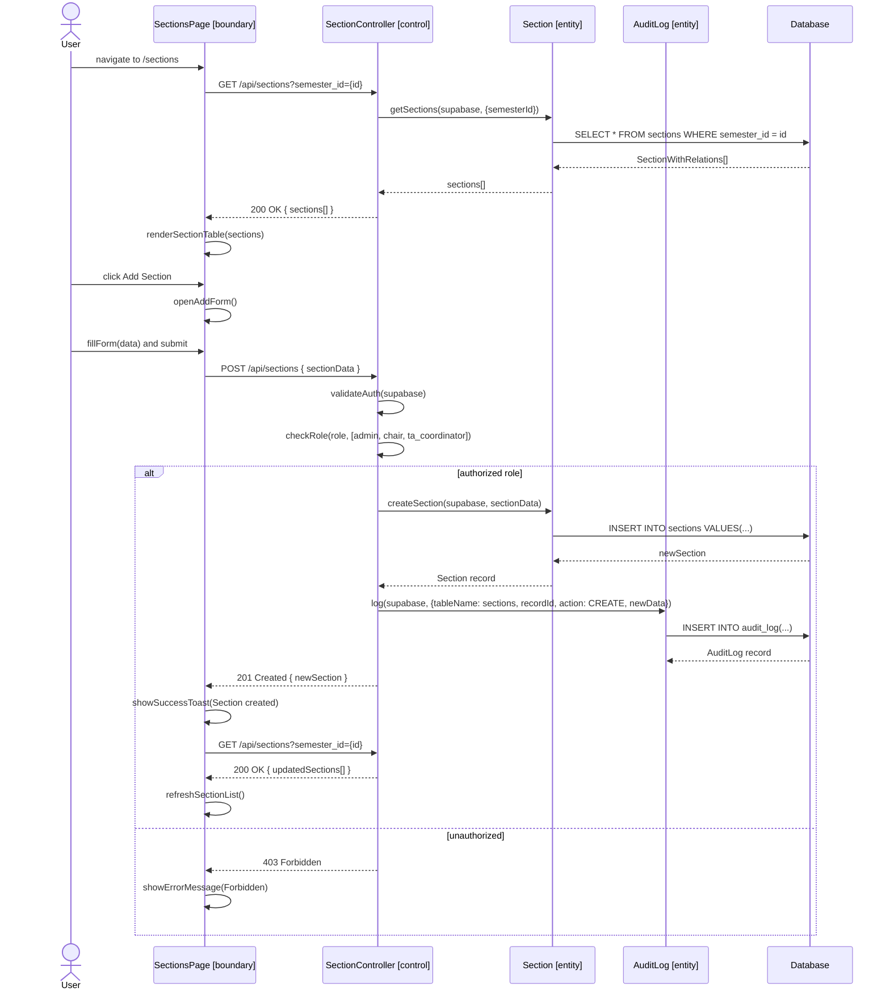

---

#### Sequence(2)_MOSS_Pj2_T-03 — UC-02: Assign TA to Section

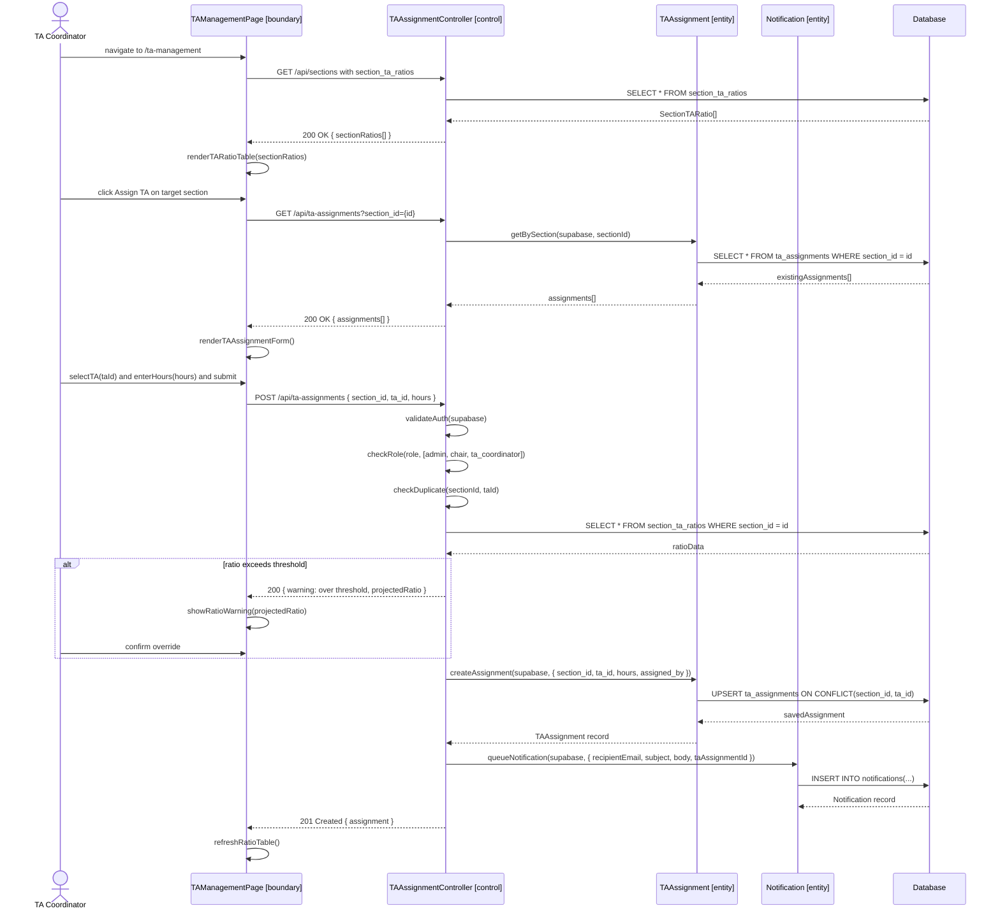

---

#### Sequence(3)_MOSS_Pj2_T-03 — UC-03: Compare Enrollment Trends

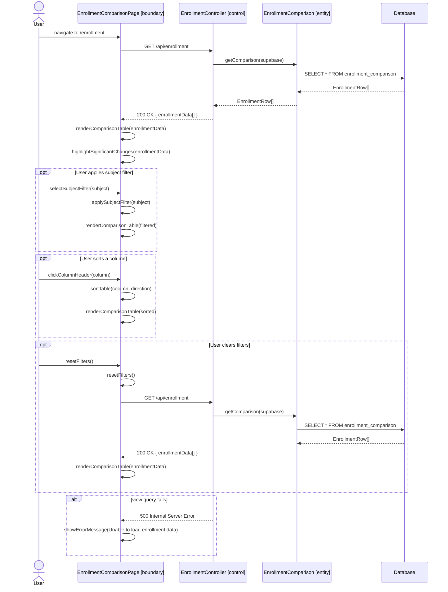

---

#### Sequence(4)_MOSS_Pj2_T-03 — UC-04: Generate and Export Workload Report

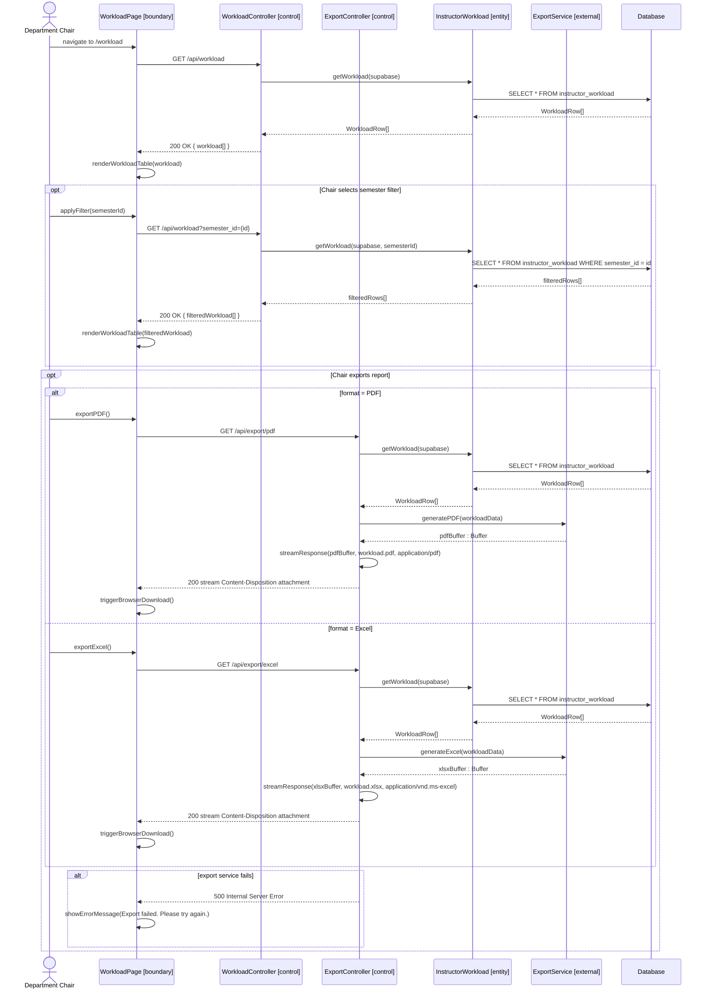
